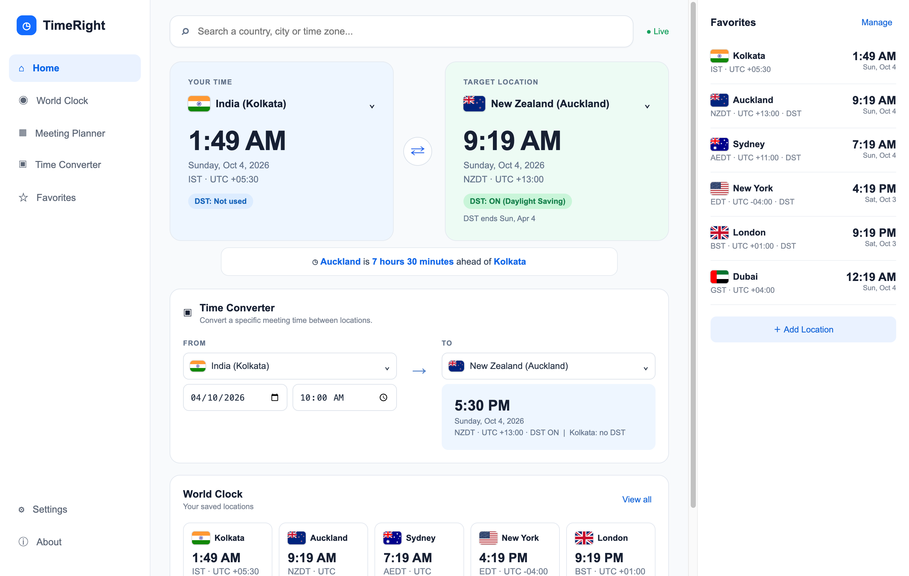
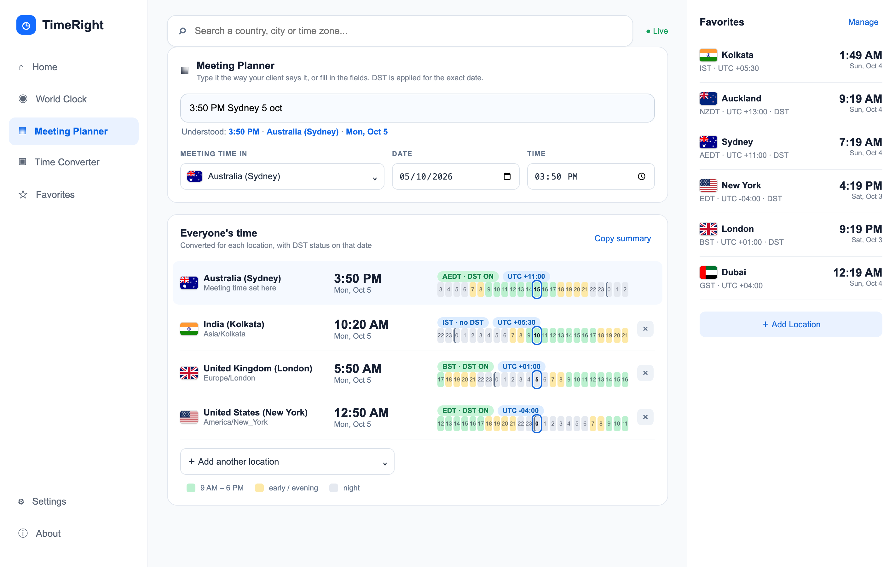

# TimeRight

**Know the real time anywhere, with DST handled correctly.** TimeRight is a free time zone converter and meeting planner for Windows, macOS and the web.

Many online converters show the wrong time because they don't know whether daylight saving time (DST) is on or off right now. TimeRight never guesses: offsets come from the IANA time zone database, evaluated for the exact date you ask about.

**[Open the web version](https://shahtijani.github.io/TimeRight/)** · **[Download for Windows / Mac](https://github.com/shahtijani/TimeRight/releases/latest)**



## What it does
- **Live time and DST status** for 400+ zones: current time, UTC offset, "DST: ON / OFF / Not used", and when DST next starts or ends
- **Meeting Planner**: type "3:50 PM Sydney tomorrow" or "10am EST friday" and see everyone's local time side by side, with a 24-hour strip showing working hours, evenings and night
- **Time Converter**: convert any date and time between two places, using the DST rules in force on that date
- **Warns about DST edge cases**: times that don't exist (clocks spring forward) and times that happen twice (clocks fall back)
- **Smart search** by city, country, nearby city (Mumbai finds India) or abbreviation (EST, IST, AEDT)
- **Favorites and world clock**, saved on your device
- **Copy summary** of a meeting to paste into an email or chat
- Works offline. No accounts, no ads, no tracking.



## How to use
1. **Check a time now:** open the app. The left card is your time, the right is the target place. Click either to search for a city or country. Press ⇄ to swap them.
2. **Plan a meeting:** open *Meeting Planner*, type something like `3:50 PM Sydney 5 oct`, then use "＋ Add another location" for everyone attending. The blue outline marks the meeting hour in each person's day. Click *Copy summary* to share it.
3. **Convert one time:** on *Home*, use the *Time Converter* card: pick From, To, a date and a time.

## Download
Get the latest installers from **Releases**:

| Platform | File |
|---|---|
| Windows | `TimeRight-Setup-<version>-win-x64.exe` (installer) or `TimeRight-Portable-<version>-win-x64.exe` (no install) |
| macOS (Apple Silicon) | `TimeRight-<version>-mac-arm64.dmg` |
| macOS (Intel) | `TimeRight-<version>-mac-x64.dmg` |

The apps are not code-signed yet, so the first launch shows a warning:
- **Windows:** SmartScreen → *More info* → *Run anyway*.
- **macOS:** drag to Applications, then right-click the app → *Open* → *Open*. If macOS says it's damaged, run `xattr -cr /Applications/TimeRight.app`.

## Run from source
Requires Node.js 20+.
```
npm install
npm start
npm test
```

## Build installers
```
npm run dist:mac     # macOS dmg + zip (run on a Mac)
npm run dist:win     # Windows installer + portable (run on Windows; CI does this for you)
```
Pushing a tag like `v0.1.0` builds both platforms on GitHub Actions and attaches them to a Release:
```
git tag v0.1.0 && git push origin v0.1.0
```

## Website
The `renderer/` folder is a plain static site (no build step). `.github/workflows/pages.yml` publishes it to GitHub Pages on every push to `main`
(Settings → Pages → Source: *GitHub Actions*).

## Project layout
- `renderer/core.js`: pure time/DST engine (no DOM), shared by desktop and web
- `renderer/locations.js` + `zones.js`: every IANA zone with country, ranked search
- `renderer/planner.js`: meeting planner logic and the natural-language parser
- `renderer/app.js`, `index.html`, `styles.css`: the UI
- `renderer/assets/flags/`: flag SVGs from [flag-icons](https://github.com/lipis/flag-icons) (MIT)
- `test/`: engine, search and planner tests (`npm test`)
- `build/`: app icon (`icon.svg` → `icon.png` via `npx electron build/render-icon.js`)

## DST notes
- DST is derived from the runtime's IANA rules, never hardcoded. Dates are interpreted in the meeting's own zone.
- Times that fall in a spring-forward gap are moved forward by the gap; repeated times let you choose which occurrence.
- `EST`/`PST`/`IST`-style abbreviations in search are shortcuts for the zones that use them; ambiguous ones list several.

## FAQ
**Why does the same 3:50 PM give different results on different dates?** Because DST changes the offset. For example, Sydney is UTC+10 until 4 Oct 2026 and UTC+11 after, so 3:50 PM Sydney is 11:20 AM in India before that date and 10:20 AM after.

**Does it need internet?** No. Time zone rules come from your device's built-in IANA database, so it works offline. Keep your OS updated, since governments occasionally change DST rules.

**What does "EST" mean in search?** It's a shortcut for places that use that abbreviation, with New York first. Eastern Time in summer is technically EDT; the app shows the correct current one.

**Why are the apps not signed?** Code signing certificates cost money. Until then, expect a one-time SmartScreen (Windows) or Gatekeeper (macOS) prompt; see Download above.

## Contributing
Issues and pull requests are welcome. Run `npm test` before submitting; the time logic is covered by tests in `test/`.

## License
MIT. Flag artwork: MIT (flag-icons). Time zone data: IANA (public domain).
